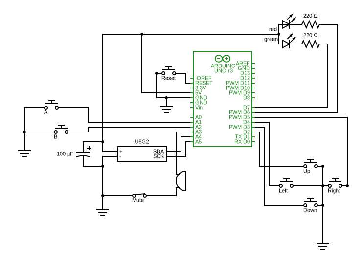

# Snake_Game
#### This repository contains the code for my fast-paced Arduino-run _Snake_ as well as the circuit for it. 

#### You can find the main file in [`Snake_Game.ino`](Snake_Game.ino)

This is the schematic:

---

## Dependencies

### Libraries

| Name | By | 
|--|--|
| [`U8g2`](https://github.com/olikraus/u8g2)| *olikraus* |
| `EEPROM` | Arduino |
| `Wire` | Arduino |

### Hardware

- An *Arduino UNO* compatible microcontroller board or any microcontroller with 6+ digital ports and I2C compatibility
- A 128×64 I2C single-color OLED display
- Passive buzzer

Everything else is shown in the [schematic](images/schematic.svg) and can be a generic type.